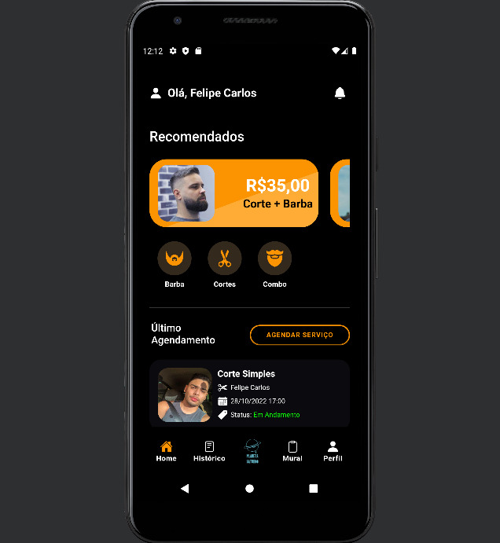

# Aplicativo de Barbearia com Agendamento - Los Ursos

### Com este app é possível o cliente (usuário do app) cadastrar sua conta no app, autenticar e acessar os recursos disponíveis, tais como:

- Visualizar o catálogo de Serviços e verificar seus preços, descrições, ou até imagens
- Ver os produtos disponíveis na loja da Barbearia, e segmentar sua busca pelas categorias
- Agendar com sistema de limitação de disponibilidade conforme horário, barbeiro e cliente
- Agendamento com opção de escolha de barbeiro e serviço desejado, com pré-visualização de preço
- Ver histórico de agendamentos, em Andamento, Cancelado ou Conclúido
- Editar seu Perfil para inserir uma foto ou apenas alterar suas informações pessoais
- Notificações na tela inicial pelo ícone de um sininho
- Mural da Barbearia com possibilidade de entender o feedback da Barbearia segundo terceiros
- Adição da sua própria declaração ao Mural da Barbearia
